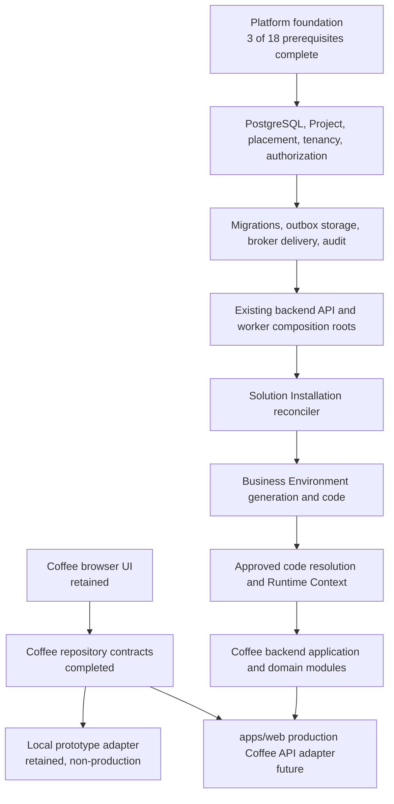

# Coffee Solution modernization and Stage 7.2 readiness review

- **Date:** 2026-07-31
- **Scope:** `solutions/coffee`, its `apps/web` integration, and the Stage 7.2
  prerequisites
- **Decision:** Incremental modernization may continue, but neither Coffee nor Stage 7.2
  is production-ready
- **Architecture changes:** None
- **ADR changes:** None
- **New deployables or composition roots:** None

## Executive decision

The repository does not contain a temporary accounting system. It contains a
browser-only Coffee administration and configuration prototype delivered for Phase 6.
Finance, accounting ledgers, orders, payments, inventory movements, and operational
workspaces are explicitly absent. The implementation must not be described or promoted
as production accounting.

The existing Coffee UI, routes, localization, form behavior, resource definitions, and
repository-facing presentation logic are reusable. The `localStorage` repository,
snapshot data model, browser permission preview, and `number`-based commercial fields
are temporary prototype infrastructure and cannot become authoritative production state.

Coffee can be the first reference **consumer** of Stage 7.2. It cannot own Solution
Installation, Business Environment generation, Business Environment Code generation,
Project placement, Runtime Context resolution, outbox delivery, or platform audit. Those
remain platform responsibilities, principally in `core-solutions-runtime` and the
accepted backend composition roots.

The modernization performed in this review exposes a Coffee-owned repository contract at
the existing `apps/web` composition boundary and adds executable tests for the local
prototype adapter. This removes a future UI rewrite dependency without choosing a
blocked backend technology.

Stage 7.2 prerequisite readiness remains **17% (3 of 18)**. Its business implementation
remains **0%** because the persistence, migration, broker, code-resolution plane,
identity, installation lifecycle, and backend composition prerequisites remain blocked.

## Sources and implementation inspected

The review used:

- `docs/reviews/2026-07-31-stage-7-2-architecture-alignment.md`;
- `docs/reviews/2026-07-31-stage-7-2-implementation-readiness.md`;
- `docs/reviews/2026-07-31-stage-7-2-implementation-progress.md`;
- `docs/open-decisions.md`;
- `COFFEE_SOLUTION.md`;
- `COFFEE_DATA_MODEL.md`;
- `COFFEE_IMPLEMENTATION_ROADMAP.md`;
- `docs/architecture/solution-engine.md`;
- `docs/architecture/dependency-rules.md`;
- all source files in `solutions/coffee`;
- all Coffee routes and the Coffee bridge in `apps/web`.

## Current implementation map

```text
apps/web
  Coffee Project routes
  -> CoffeeProjectBridge
  -> CoffeeProjectEnvironment
  -> CoffeeWorkspaceProvider
  -> CoffeeRepositories
  -> localCoffeeRepositories
  -> browser localStorage
```

The current package contains approximately 6,700 lines of Coffee browser code. It has
configuration screens for business profile, locations, registers, workstations, menu,
recipes, ingredients, units, warehouses, suppliers, employees, roles, permissions,
settings, and setup progress.

It does not contain:

- accounting or finance posting behavior;
- order or payment processing;
- inventory movements or stock ledgers;
- PostgreSQL repositories or migrations;
- server-side authorization;
- Solution Installation or Business Environment behavior;
- Runtime Context resolution;
- transactional outbox, audit persistence, or backend telemetry;
- production backend configuration.

## Production-suitable assets to retain

| Asset                                                        | Assessment                   | Modernization treatment                                                                          |
| ------------------------------------------------------------ | ---------------------------- | ------------------------------------------------------------------------------------------------ |
| `solutions/coffee` ownership boundary                        | Correct                      | Retain as the Coffee-specific browser package                                                    |
| Existing `apps/web` Coffee routes                            | Correct topology             | Retain; do not create another browser application                                                |
| `CoffeeProjectBridge` composition location                   | Correct browser boundary     | Extend later with a production API adapter                                                       |
| RU/EN localization resources                                 | Reusable                     | Retain and continue key-based localization                                                       |
| Responsive shell and project-scoped navigation               | Reusable presentation        | Retain subject to accessibility and E2E verification                                             |
| Form, empty, loading, error, denied, and confirmation states | Reusable UX work             | Retain; repeat validation authoritatively on the backend                                         |
| Coffee capability vocabulary and role templates              | Useful input                 | Reconcile with the future platform capability catalog; never treat the browser copy as authority |
| Resource definitions                                         | Useful presentation metadata | Retain where they describe forms, not business invariants                                        |
| Repository-facing workspace store                            | Reusable adapter seam        | Retain after dependency injection introduced in this review                                      |
| TypeScript strictness and package exports                    | Suitable foundation          | Retain and extend with dependency enforcement                                                    |

## Temporary implementation and technical debt

### CFM-001 — The stated accounting implementation does not exist

- **Evidence:** `COFFEE_FINANCE_FLOW.md` is documentation; the UI labels the Finance
  ledger as not implemented. No posting batch, posting line, close, reconciliation, or
  immutable financial document code exists.
- **Impact:** Treating configuration screens as accounting would produce false
  production-readiness and data-integrity claims.
- **Resolution:** Implement Finance only in the official Coffee roadmap after orders,
  payments, inventory valuation, and posting prerequisites exist.
- **Priority:** Critical.

### CFM-002 — Browser storage is the authoritative prototype store

- **Evidence:** `localCoffeeRepositories` serializes a complete `CoffeeSnapshot` to a
  Project-keyed `localStorage` record.
- **Impact:** No server authority, RLS, transaction isolation, concurrency control,
  recovery, backups, audit, or cross-device consistency.
- **Resolution:** Keep it only as an explicitly named local prototype adapter. Replace
  it at the existing `apps/web` composition boundary with an HTTP/BFF adapter after the
  accepted backend foundation exists.
- **Priority:** Critical.

### CFM-003 — The snapshot is not a production domain model

- **Evidence:** All configuration resources, roles, permissions, setup state, and
  activity are stored in one mutable snapshot.
- **Impact:** Independent aggregate consistency, concurrency, retention, migration,
  versioning, and module ownership cannot be enforced.
- **Resolution:** Introduce Coffee module-owned aggregates and repositories
  incrementally per official module. Do not migrate the snapshot shape as a database
  schema.
- **Priority:** Critical.

### CFM-004 — Money and quantity use binary floating point

- **Evidence:** `sellingPrice`, `cost`, quantities, waste, and conversion rates use
  TypeScript `number`.
- **Conflict:** The approved Coffee model requires decimal-safe `Money` and `Quantity`
  with currency, unit, dimension, and rounding policy.
- **Impact:** Rounding drift and irreproducible financial, recipe, and stock history.
- **Resolution:** Add Coffee domain value objects using the repository-wide accepted
  decimal strategy before any operational or ledger persistence.
- **Priority:** Critical before business transactions.

### CFM-005 — Most identifiers and references are unchecked strings

- **Evidence:** IDs, SKUs, currency, timezone, tax mode, location references, recipe
  references, and unit references are primitive strings.
- **Impact:** Broken references and invalid states can pass through repository methods;
  UI validation is bypassable.
- **Resolution:** Introduce domain-specific IDs and validation at Coffee application
  use-case boundaries. Database constraints complement domain validation.
- **Priority:** High.

### CFM-006 — Historical configuration is mutable

- **Evidence:** generic update methods replace existing objects and update timestamps.
- **Conflict:** Approved Coffee rules require versioned menu, recipe, policy, price,
  tax, and posted-document history.
- **Impact:** Past transactions would become irreproducible if these structures were
  reused operationally.
- **Resolution:** Keep mutable CRUD only for the setup prototype. Implement explicit
  draft/publish/version/retire lifecycles for production aggregates.
- **Priority:** Critical before operations.

### CFM-007 — Authorization is a browser preview

- **Evidence:** the selected mock role controls `can()` in React state and
  `localStorage`.
- **Impact:** Hidden UI is not security; direct requests would bypass it.
- **Resolution:** Preserve permission-aware UX, but obtain authoritative capabilities
  from verified platform Actor/Project context and enforce them in backend use cases.
- **Priority:** Critical.

### CFM-008 — Repository operations lack production command semantics

- **Evidence:** no idempotency key, expected revision, actor context, correlation ID,
  placement/fencing token, or transaction boundary is present.
- **Impact:** retries and concurrent writes can duplicate or overwrite work.
- **Resolution:** The future API adapter must use platform command envelopes and
  versioned Coffee application contracts. Do not add these concerns to generic browser
  CRUD methods prematurely.
- **Priority:** High.

### CFM-009 — Activity history is not audit

- **Evidence:** activity records are mutable, capped at twelve entries, stored with the
  snapshot, and contain no verified actor or immutable integrity controls.
- **Impact:** It cannot satisfy legal, security, support, or forensic audit
  requirements.
- **Resolution:** Continue using it only as preview UI data. Production audit uses the
  separate platform audit boundary while Coffee owns business history and source
  references.
- **Priority:** Critical.

### CFM-010 — Installation and runtime activation are simulated

- **Evidence:** initial snapshot creation inserts an `activity.solutionInstalled` row
  and allows setup immediately; no manifest, artifact lock, desired/effective state,
  health gate, Business Environment, or Runtime Context is consulted.
- **Impact:** Coffee can appear active without a valid platform installation.
- **Resolution:** Gate the production adapter and Coffee route contributions on the
  effective Solution Installation and resolved Runtime Context delivered by the
  platform. Keep the current behavior for prototype mode only.
- **Priority:** Critical.

### CFM-011 — Automated verification remains narrow

- **Evidence:** this review adds four repository adapter tests; there are no Coffee
  domain, component, accessibility, API contract, PostgreSQL, migration, RLS,
  concurrency, recovery, or E2E suites.
- **Impact:** Current green checks validate only a small prototype boundary.
- **Resolution:** Add tests with each production module and pass the cross-phase Coffee
  definition of done. Never count mock isolation tests as RLS evidence.
- **Priority:** High.

### CFM-012 — Production operations are absent by design

- **Evidence:** no backend health, telemetry export, secrets, deployment configuration,
  migrations, runbooks, SLOs, backup, restore, or incident diagnostics exist for Coffee.
- **Impact:** The Solution cannot be operated or recovered.
- **Resolution:** Reuse platform config and observability contracts from Coffee backend
  adapters after backend composition exists; add Coffee-specific metrics and runbooks
  without creating a Coffee deployable.
- **Priority:** Critical for production.

## Modernization completed in this review

### Coffee repository adapter seam

The repository contracts were extracted from the browser adapter into
`repository-contracts.ts` and exported from the Solution public entry point.
`CoffeeProjectEnvironment` now accepts an optional `CoffeeRepositories` implementation.

This makes the future flow:

```text
apps/web CoffeeProjectBridge
  -> production Coffee API adapter
  -> existing CoffeeProjectEnvironment
  -> unchanged Coffee screens
```

The current composition still defaults to `localCoffeeRepositories`, preserving the
working prototype and avoiding an unnecessary rewrite.

### Executable prototype contract tests

Four tests now prove:

- Project-keyed local data does not mix accidentally;
- repository results are defensive copies;
- setup readiness rejects incomplete configuration;
- one Project cannot select another Project's local location record.

These tests are deliberately described as prototype adapter tests. They do not claim
database isolation, backend authorization, or production persistence.

## Reusable platform components extracted

No new platform component was extracted from Coffee.

This is intentional. The new repository contracts are Coffee-specific and remain under
`solutions/coffee`. Moving them into Core or shared infrastructure would violate the
product dependency rule and create a Solution-specific platform API.

The already implemented reusable platform foundations remain:

| Platform component                                       | Owner                          | Intended Coffee use                                     |
| -------------------------------------------------------- | ------------------------------ | ------------------------------------------------------- |
| IDs, clocks, operation and correlation primitives        | `core-kernel`                  | Backend Coffee application commands and records         |
| Typed runtime configuration boundary                     | `infrastructure-config`        | Existing API/worker composition roots                   |
| Structured logs, metrics, traces, and redaction boundary | `infrastructure-observability` | Coffee backend adapters through composition             |
| Solution runtime manifest contract                       | `contracts-platform`           | Deployment/runtime registration after lifecycle support |
| Browser Solution runtime registry                        | `frontend-extension-host`      | Runtime UI contribution registration                    |

Extraction into platform code should occur only when at least two consumers demonstrate
the same stable, Solution-neutral contract.

## Remaining platform gaps

| Gap                                    | Owner project(s)                                   | Why Coffee cannot supply it                                    | Status                                   |
| -------------------------------------- | -------------------------------------------------- | -------------------------------------------------------------- | ---------------------------------------- |
| PostgreSQL access and migration stack  | `infrastructure-persistence`, `infra/postgres`     | Repository-wide RLS and transaction decision                   | Blocked open decision                    |
| Project lifecycle and placement        | `core-projects`, `core-project-placement`          | Platform authority and fencing                                 | Blocked by persistence                   |
| Verified Project tenancy               | `core-tenancy`                                     | Cross-Solution security boundary                               | Blocked by persistence                   |
| Authoritative capability authorization | `core-access-control`                              | Platform Actor/Project policy                                  | Blocked by persistence and OIDC          |
| Transactional outbox storage           | `infrastructure-persistence`                       | Shared atomic delivery plumbing                                | Blocked by persistence                   |
| Broker delivery                        | `infrastructure-messaging`, data-plane worker      | Shared asynchronous runtime                                    | Blocked broker decision                  |
| Immutable audit                        | `core-audit`                                       | Separate platform security boundary                            | Blocked by persistence/backend decision  |
| Backend API and worker composition     | existing API/worker apps                           | Must compose all security and infrastructure boundaries        | Blocked transitively                     |
| Solution Installation reconciler       | `core-solutions-runtime`                           | Core lifecycle authority                                       | Blocked transitively                     |
| Business Environment generation/code   | `core-solutions-runtime`                           | Solution-neutral Stage 7.2 responsibility                      | Not started                              |
| Code-resolution directory plane        | `core-solutions-runtime`, `core-project-placement` | Cross-plane platform routing contract                          | Blocking architecture decision           |
| Manager read path                      | control-plane API, `core-solutions-runtime`        | Platform identity and capability boundary                      | Blocked                                  |
| Runtime Context resolution             | platform runtime, consumed by Coffee               | Must be identical for every Solution                           | Blocked by Stage 7.2 and code resolution |
| Production verification harness        | `toolchain-testing`, backend projects              | Real RLS, migration, broker, restart, and concurrency evidence | Blocked                                  |

## Updated dependency graph



## Ordered migration plan

1. **Preserve the current prototype.** Keep routes and screens operational through the
   local adapter while production work is behind an explicit non-production mode.
2. **Close platform decisions.** Accept the PostgreSQL/migration stack, broker, OIDC,
   and authoritative Business Environment code-resolution plane.
3. **Complete Stage 7.2 prerequisites.** Implement PR-03 through PR-18 in the order
   defined by the Stage 7.2 progress report.
4. **Implement Stage 7.2 in the platform.** Add the Business Environment checkpoint,
   code generation, persistence, migration, outbox intent, audit intent, manager
   projection, and verification to `core-solutions-runtime`.
5. **Establish the Coffee installation descriptor.** Add a signed/versioned Coffee
   manifest, capability catalog, configuration schema, health contribution, and
   migration stream using public platform contracts. Do not add Coffee knowledge to
   Core.
6. **Resolve Runtime Context at composition.** The platform resolves the environment
   from the code and installation; Coffee receives a verified, minimal context through a
   public contract.
7. **Implement Coffee administrative backend by bounded module.** Begin with
   configuration aggregates and versioning. Use decimal-safe values and explicit
   Project/location scope. Avoid porting the snapshot schema.
8. **Supply the production browser adapter.** Implement `CoffeeRepositories` over the
   approved API client/BFF at `apps/web`; keep Coffee presentation unchanged where
   contracts remain compatible.
9. **Retire local authority.** Keep the local adapter only for storybook/test/demo use,
   or remove it after an approved migration and product decision. Never silently upload
   browser snapshot data into production.
10. **Continue the official Coffee roadmap.** Employee operations, inventory, finance,
    analytics, and production hardening follow their documented gates.

## Implementation commits

| Commit    | Change                                                                     |
| --------- | -------------------------------------------------------------------------- |
| `3e4b9a5` | Expose the Coffee repository adapter seam and add prototype contract tests |

No PostgreSQL, migration, broker, Runtime Context, Business Environment, Solution
Installation, or production configuration code was added because their prerequisites
remain unresolved.

## Readiness after modernization

### Stage 7.2

- Completed prerequisites: 3 of 18.
- Readiness: **17%**.
- Business Environment implementation: **0%**.
- Change from this Coffee modernization: **0 percentage points**; Coffee must not be
  counted as a platform prerequisite.

### Coffee

- Browser administration prototype: working and reusable.
- Production adapter boundary: established.
- Production persistence and backend: absent.
- Platform installation/runtime integration: absent.
- Operational Coffee modules: absent.
- Finance/accounting: absent.
- Production readiness: **No**.

The correct next implementation action is not to write a Coffee-owned substitute. It is
to resolve the listed platform decisions and complete the existing Stage 7.2 dependency
chain.

## Stage 7.3 impact assessment

The repository seam reduces Stage 7.3 migration cost because Runtime Context and
production data access can be composed into the existing Coffee UI without a new browser
application or route tree.

Stage 7.3 remains blocked until:

- `BusinessEnvironmentCode -> BusinessEnvironment -> Project/placement` has an approved
  authoritative model;
- Stage 7.2 persists and resolves the environment;
- the effective Solution Installation can be verified;
- the platform provides a transport-neutral minimal Runtime Context;
- authenticated and authorized API composition exists.

This review introduces no Stage 7.3 schema, public platform API, browser shell,
deployable, or composition root, so it does not constrain the pending cross-plane
decision.

## Validation evidence

The implementation commit passed:

- `nx affected:test`: 37 tests across Coffee and `apps/web`;
- `nx affected:lint`;
- `nx affected:typecheck`;
- `nx affected:build`, including the optimized Next.js production build;
- `architecture:check`: 31 projects, 181 Markdown files, and 38 ADRs;
- Nx dependency graph generation;
- Prettier and `git diff --check`.

## Final architecture compliance

- Coffee remains a consumer of platform contracts.
- No Coffee business logic moved into Core.
- No Solution-specific platform API was created.
- No new browser application, deployable, or composition root was created.
- No accepted ADR or Stage 7.2 business rule was changed.
- Working browser code was preserved and adapted incrementally.
- Blocked infrastructure was not simulated or selected locally.
