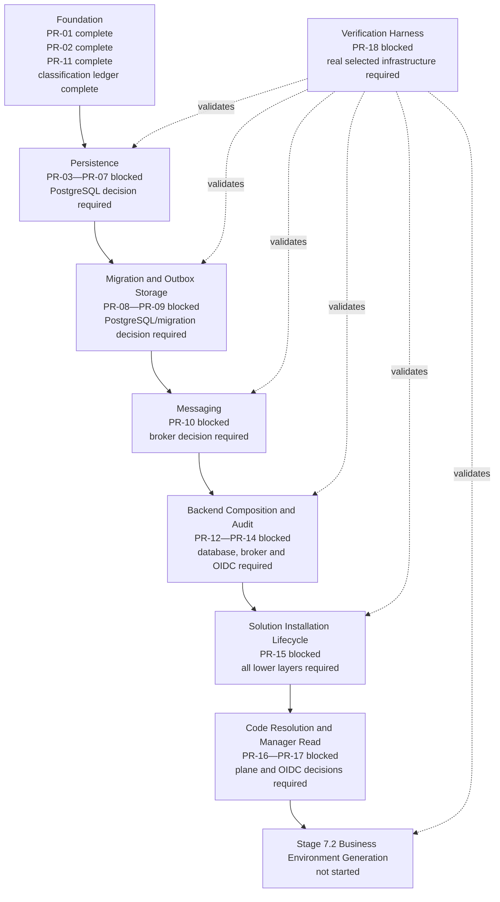

# Stage 7.2 prerequisite implementation progress

- **Date:** 2026-07-31
- **Scope:** Prerequisites for Business Environment Generation
- **Stage 7.2 business implementation:** Not started
- **Prerequisites completed:** 3 of 18
- **Additional governance gate completed:** 1
- **Readiness:** 17%
- **Architecture changes:** None
- **ADR changes:** None
- **New browser applications:** None
- **New deployables:** None
- **New composition roots:** None

## 1. Executive status

Every prerequisite from `2026-07-31-stage-7-2-implementation-readiness.md` was evaluated
in order.

Three prerequisites can be completed independently of unresolved architecture and
provider decisions:

- PR-01 Core primitives;
- PR-02 Typed runtime configuration;
- PR-11 Observability.

The ADR 0018 data-classification and lifecycle-ledger gate identified by S72-010 was
also completed. Business Environment Code now defaults to Confidential, has explicit
redaction and non-reuse rules, and is covered by an automated architecture-document
check.

The remaining fifteen prerequisites cannot be completed without selecting or depending
on at least one unresolved PostgreSQL/migration, queue/broker, OIDC, observability/audit
backend, or code-resolution-plane decision. No partial adapter, in-memory production
substitute, synchronous installation path, direct event publication, or other temporary
architecture was introduced.

## 2. Completed prerequisites

### PR-01 — Core primitives

- **Affected Nx project:** `core-kernel`
- **Public contracts implemented:**
  - branded `ActorId`, `AggregateId`, `ProjectId`, `SolutionId`,
    `SolutionInstallationId`, `OperationId`, `EventId`, `CorrelationId`, and
    `CausationId`;
  - validated canonical `Timestamp`, injectable `Clock`, and `SystemClock`;
  - transport-neutral `Result`, `ApplicationError`, `ok`, `err`, and `unwrap`;
  - validated `AggregateVersion`, initial version, and monotonic increment;
  - immutable, versioned `DomainEvent`, `DomainEventMetadata`, and Project/global
    `EventScope`.
- **Tests added:** 19 unit tests covering identifier validation, timestamp
  canonicalization, aggregate versions, results, and domain-event invariants.
- **Documentation updated:** `packages/core/kernel/README.md`.
- **Quality gates:** affected test, lint, build, typecheck, architecture check,
  generated Nx dependency graph, and `git diff --check` passed.
- **Commit:** `e45afb7` — `feat(core): implement kernel primitives`

### PR-02 — Typed runtime configuration

- **Affected Nx project:** `infrastructure-config`
- **Public contracts implemented:**
  - explicit `ConfigSource` and immutable `RecordConfigSource`;
  - `SecretReference`, `SecretResolver`, and strict `secret://` validation;
  - `ConfigReader`, aggregated `ConfigIssue`, and redaction-safe
    `ConfigurationValidationError`;
  - provider-neutral `DatabaseRuntimeConfig`, `MigrationRuntimeConfig`,
    `WorkerRuntimeConfig`, `MessagingRuntimeConfig`, and `TelemetryRuntimeConfig`;
  - `loadBackendRuntimeConfig` with defaults, ranges, enum checks, and cross-field
    invariants.
- **Tests added:** 14 unit tests covering secret-reference safety, valid/default
  configuration, immutability, aggregated validation, non-disclosure of raw credentials,
  numeric bounds, booleans, and cross-field invariants.
- **Documentation updated:** `packages/infrastructure/config/README.md`.
- **Quality gates:** affected test, lint, build, typecheck, architecture check,
  generated Nx dependency graph, and `git diff --check` passed.
- **Commit:** `73429de` — `feat(infrastructure): add validated runtime config`

### PR-11 — Observability

- **Affected Nx project:** `infrastructure-observability`
- **Public contracts implemented:**
  - immutable `CorrelationContext`, telemetry attributes, and clock contracts;
  - `StructuredLogger`, `LogSink`, immutable log records, and
    `RedactingStructuredLogger`;
  - default redaction for credentials, secrets, tokens, connection strings, and Business
    Environment Codes;
  - `Counter`, `Histogram`, `Meter`, and metric-cardinality validation;
  - `TraceSpan`, `Tracer`, span kinds/statuses, and safe error-type recording;
  - `OpenTelemetryMeterAdapter` and `OpenTelemetryTracerAdapter`.
- **Required infrastructure:** The accepted OpenTelemetry API boundary is added through
  the central pnpm catalog. No telemetry backend or exporter vendor was selected.
- **Tests added:** 18 unit tests covering redaction, immutable structured records,
  correlation, invalid names, forbidden metric labels, non-finite values, no-op
  OpenTelemetry operation before provider wiring, trace success, and safe error
  propagation.
- **Documentation updated:** `packages/infrastructure/observability/README.md`.
- **Quality gates:** affected test, lint, build, typecheck, architecture check,
  generated Nx dependency graph, and `git diff --check` passed.
- **Commit:** `3585f37` — `feat(infrastructure): add observability boundary`

## 3. Additional completed governance prerequisite

### Business Environment classification and lifecycle ledger

- **Affected project/tooling:** `core-solutions-runtime`, architecture checker.
- **Public contracts implemented:** None; this is a data-governance prerequisite.
- **Policy completed:**
  - field-level classification;
  - authoritative and derived-copy inventory;
  - Business Environment Code defaulted to Confidential;
  - log/trace/metric prohibitions;
  - restricted audit treatment;
  - export, archival, logical deletion, permanent non-reuse, residency, encryption,
    backup, and recovery rules;
  - explicit acknowledgement that the authoritative storage plane remains unresolved.
- **Automated validation added:** Architecture validation requires the ledger and its
  classification, copy inventory, telemetry, deletion, recovery, and ownership sections.
- **Documentation updated:**
  - `packages/core/solutions-runtime/DATA_LIFECYCLE.md`;
  - `packages/core/solutions-runtime/README.md`.
- **Quality gates:** affected commands reported no executable targets for the
  documentation-only placeholder project; architecture check, generated dependency
  graph, formatting, and `git diff --check` passed.
- **Commit:** `9780765` — `docs(governance): classify solution runtime data`

## 4. Remaining blocked prerequisites

### PR-03 — Project lifecycle

- **Owner project:** `core-projects`
- **Dependency:** Module-owned PostgreSQL repository adapter and transaction support.
- **Blocking open decision:** PostgreSQL access library and migration tool.
- **Exact reason:** A complete lifecycle requires authoritative persistence and
  concurrency behavior. Implementing only entities or an in-memory repository would be
  an incomplete temporary architecture.

### PR-04 — Project placement

- **Owner project:** `core-project-placement`
- **Dependency:** Authoritative control-plane placement store, transactions, fencing
  epoch persistence, and signed snapshot storage.
- **Blocking open decision:** PostgreSQL access library and migration tool.
- **Exact reason:** Fencing correctness must be durable and database-authoritative.
  Memory-only placement cannot fence concurrent or restarted writers.

### PR-05 — Verified tenancy

- **Owner project:** `core-tenancy`
- **Dependency:** Project-scoped transaction/unit-of-work adapter with transaction-local
  RLS scope and placement validation.
- **Blocking open decision:** PostgreSQL access library and migration tool.
- **Exact reason:** The public scope contract cannot be declared operational without a
  real adapter that proves `SET LOCAL`/equivalent scope, assertion, rollback, timeout,
  cancellation, and pool-reuse behavior.

### PR-06 — Authorization

- **Owner project:** `core-access-control`
- **Dependency:** Authoritative membership/policy persistence and authenticated
  `ActorContext`.
- **Blocking open decisions:** PostgreSQL access library and migration tool; OIDC
  provider for real actor identity.
- **Exact reason:** A complete capability decision requires durable policy revisions and
  trusted identity input. Local role tables or mock actors would bypass authoritative
  enforcement.

### PR-07 — PostgreSQL access

- **Owner projects:** `infrastructure-persistence`, `infra/postgres`
- **Dependency:** Driver/access layer, pool, transaction adapter, Project-scope adapter,
  restricted roles, and error mapping.
- **Blocking open decision:** PostgreSQL access library and migration tool.
- **Exact reason:** Architecture governance explicitly blocks persistence implementation
  until Data Platform selects a repository-wide stack against RLS, transaction, SQL
  visibility, migration-safety, and NestJS criteria.

### PR-08 — Migration execution

- **Owner projects:** `infrastructure-persistence`; module migration streams remain with
  their owners.
- **Dependency:** Accepted migration tool, migration role, journal, checksum, ordering,
  and expand/contract execution.
- **Blocking open decision:** PostgreSQL access library and migration tool.
- **Exact reason:** A provider-neutral fake cannot prove real PostgreSQL DDL,
  transaction, role, RLS, replay, checksum, or rolling-compatibility behavior.

### PR-09 — Outbox storage

- **Owner projects:** `infrastructure-persistence`; business records remain with
  `core-solutions-runtime`.
- **Dependency:** PostgreSQL transaction/UoW implementation, indexes, concurrent claim
  semantics, publication checkpoints, and inbox deduplication.
- **Blocking open decision:** PostgreSQL access library and migration tool.
- **Exact reason:** Atomic state-plus-outbox persistence and safe multi-worker claiming
  depend on the real database adapter and SQL semantics.

### PR-10 — Messaging delivery

- **Owner projects:** `infrastructure-messaging`, `app-data-plane-worker`
- **Dependency:** Accepted broker adapter, publisher/consumer runtime, retry, replay,
  dead-letter behavior, and PR-09 outbox storage.
- **Blocking open decisions:** Queue/event broker; PostgreSQL access library and
  migration tool transitively through outbox storage.
- **Exact reason:** Selecting a broker is explicitly blocked. Direct calls, an
  in-process event bus, or fire-and-forget publication would violate ADR 0008 and
  ADR 0023.

### PR-12 — Audit

- **Owner project:** `core-audit`
- **Dependency:** Append-only PostgreSQL store, restricted writer/query roles,
  retention, integrity checkpoints, and eventual immutable/WORM export.
- **Blocking open decisions:** PostgreSQL access library and migration tool;
  observability and audit backends before staging.
- **Exact reason:** A complete audit prerequisite must prove immutability, separate
  authorization, retention, and export. A logger or in-memory recorder is explicitly not
  audit.

### PR-13 — Backend API composition

- **Owner projects:** `app-control-plane-api`, `app-data-plane-api`
- **Dependency:** PR-03 through PR-12, NestJS wiring, real identity, authorization,
  persistence, observability, and audit adapters.
- **Blocking open decisions:** PostgreSQL access library and migration tool; OIDC
  provider; downstream provider decisions inherited from composed modules.
- **Exact reason:** Bootstrapping empty APIs without their mandatory request lifecycle
  would create a temporary composition architecture and could not enforce Project scope
  or manager authorization.

### PR-14 — Backend worker composition

- **Owner projects:** `app-control-plane-worker`, `app-data-plane-worker`
- **Dependency:** Persistence, migrations, outbox storage, broker delivery,
  observability, audit, placement, and fencing.
- **Blocking open decisions:** PostgreSQL access library and migration tool; queue/event
  broker.
- **Exact reason:** A worker without durable checkpoints, placement fencing, outbox
  claiming, and broker delivery cannot satisfy restart or multi-instance guarantees.

### PR-15 — Solution Installation lifecycle

- **Owner project:** `core-solutions-runtime`
- **Dependency:** PR-03 through PR-14.
- **Blocking open decisions:** PostgreSQL/migration, queue/event broker, OIDC for
  manager initiation, and code-resolution plane where environment identity becomes part
  of effective installation.
- **Exact reason:** ADR 0024 requires durable desired/effective state, monotonic
  operation IDs, checkpoints, fencing, recovery, outbox events, and final activation.
  None may be replaced by synchronous or in-memory orchestration.

### PR-16 — Code-resolution directory model

- **Owner projects:** `core-solutions-runtime`, `core-project-placement`;
  `contracts-platform` only if a cross-runtime transport-neutral schema is approved.
- **Dependency:** Authoritative location and contract for
  `BusinessEnvironmentCode -> ProjectId -> effective placement`.
- **Blocking architectural decision:** Authoritative Business Environment
  code-resolution plane and cross-plane consistency contract.
- **Exact reason:** Shard-local-only storage requires fan-out, while a global directory
  changes credential, privacy, replication, and availability semantics. Stage 7.3
  forbids a later schema redesign.

### PR-17 — Manager read path

- **Owner projects:** `core-solutions-runtime`, `app-control-plane-api`
- **Dependency:** Real identity, capability authorization, Project resolution,
  installation persistence, Business Environment persistence, and API composition.
- **Blocking open decisions:** OIDC provider; PostgreSQL access library and migration
  tool; PR-16 code-resolution plane.
- **Exact reason:** A read endpoint cannot safely expose a Confidential code until actor
  identity, Project authority, storage ownership, and post-activation visibility are
  authoritative.

### PR-18 — Backend verification harness

- **Owner projects:** `toolchain-testing`, affected backend projects, `infra/postgres`
- **Dependency:** Real PostgreSQL stack, migration runner, restricted roles, broker,
  backend composition, and concurrency/property-test fixtures.
- **Blocking open decisions:** PostgreSQL access library and migration tool; queue/event
  broker; composed-provider decisions.
- **Exact reason:** Generic unit-test utilities cannot complete the required RLS,
  migration, outbox, replay, restart, and cluster suites without the selected real
  infrastructure. A mock-only harness would produce false readiness.

## 5. Current dependency graph



## 6. Updated implementation order

1. **Data Platform decision:** Select PostgreSQL access library and migration tool.
2. **Platform Reliability decision:** Select queue/event broker.
3. **Platform Architecture, Extension Platform, and Data Platform decision:** Approve
   the authoritative Business Environment code-resolution plane and contract.
4. **Security Architecture decision:** Select OIDC provider before identity wiring.
5. Implement PR-07 and PR-08: PostgreSQL and migration foundation.
6. Implement PR-03 through PR-06: Project lifecycle, placement, verified tenancy, and
   authorization against the real persistence boundary.
7. Implement PR-09 and PR-10: transactional outbox storage and broker delivery.
8. Implement PR-12: separate append-only audit.
9. Implement PR-13 and PR-14 inside the existing four backend composition roots.
10. Implement PR-15: durable Solution Installation reconciler.
11. Implement PR-16: approved code-resolution directory model.
12. Implement PR-17: capability-authorized manager read path.
13. Implement PR-18 and pass real database, migration, RLS, outbox, broker, restart,
    replay, fencing, and architecture suites.
14. Re-run the Stage 7.2 entry gate.
15. Only then begin Business Environment Generation.

## 7. Commits created

| Commit    | Completed item                                           |
| --------- | -------------------------------------------------------- |
| `e45afb7` | PR-01 Core primitives                                    |
| `73429de` | PR-02 Typed runtime configuration                        |
| `3585f37` | PR-11 Observability                                      |
| `9780765` | Business Environment classification and lifecycle ledger |

## 8. Remaining open decisions

### Direct Stage 7.2 blockers

| Decision                                                            | Owner                                                    | Blocks                                                    |
| ------------------------------------------------------------------- | -------------------------------------------------------- | --------------------------------------------------------- |
| PostgreSQL access library and migration tool                        | Data Platform                                            | PR-03 through PR-09, PR-12 through PR-15, PR-17 and PR-18 |
| Queue/event broker                                                  | Platform Reliability                                     | PR-10, PR-14, PR-15 and PR-18                             |
| Business Environment code-resolution plane and cross-plane contract | Platform Architecture, Extension Platform, Data Platform | PR-16, PR-17 and final Stage 7.2 schema ownership         |
| OIDC provider and federation roadmap                                | Security Architecture                                    | Real identity in PR-06, PR-13 and PR-17                   |

### Production/staging gates that remain open

| Decision                                        | Owner                        | Impact                                                                                                            |
| ----------------------------------------------- | ---------------------------- | ----------------------------------------------------------------------------------------------------------------- |
| Observability and audit backends                | Reliability and Security     | PR-11 contracts are complete; staging export, retention, access isolation and immutable audit sink remain blocked |
| Production orchestrator and IaC stack           | Infrastructure               | Does not block pure package implementation; blocks staging                                                        |
| Initial SLO, RPO, RTO and invalidation deadline | Product and Reliability      | Blocks production readiness and final performance/recovery thresholds                                             |
| Cell/shard placement thresholds                 | Data Platform                | Blocks the first scale gate, not current contract design                                                          |
| Project-level encryption/crypto-shredding tier  | Security and Data Governance | Not assumed by the lifecycle ledger; required only if the product adopts that deletion tier                       |

## 9. Readiness calculation

The implementation readiness percentage uses the eighteen prerequisites in the approved
readiness report:

```text
3 completed prerequisites / 18 total prerequisites = 16.7%
```

Rounded Stage 7.2 readiness: **17%**.

The classification/lifecycle ledger is reported separately because it closes a
governance gate identified by S72-010 but is not one of PR-01 through PR-18. Stage 7.2
business implementation remains at **0%** and must not begin while the listed decisions
and transitive prerequisites remain blocked.
