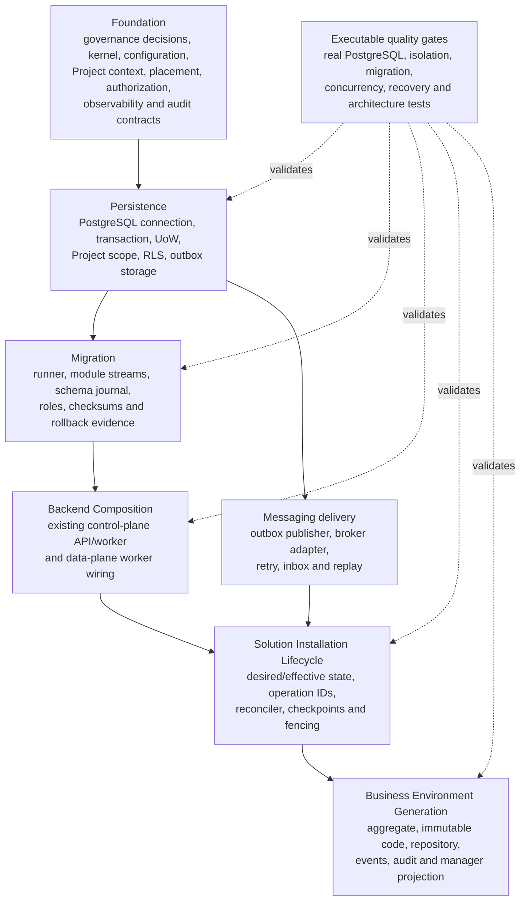

# Stage 7.2 technical implementation readiness report

- **Date:** 2026-07-31
- **Scope:** Business Environment Generation
- **Readiness:** Not ready for implementation
- **Source review:** `2026-07-31-stage-7-2-architecture-alignment.md`
- **Production source changes:** None
- **ADR changes:** None

## 1. Readiness decision

All twelve conflicts in the architecture alignment review are valid.

The repository already contains the correct ownership boundaries, but most required
backend projects contain only `README.md` and `project.json` files with empty Nx target
sets. The root manifest contains no NestJS, PostgreSQL access, migration, messaging,
OpenTelemetry, property-testing, or database-container dependencies.

Stage 7.2 must therefore remain blocked. Implementing only the Business Environment
domain model would produce an isolated partial implementation that could not meet the
required persistence, transaction, migration, installation, concurrency, recovery,
audit, observability, or quality-gate contracts.

No missing prerequisite requires a new browser application, deployable, composition
root, or reversal of accepted architecture. Some prerequisites do require the governance
process to close existing provider and cross-plane contract decisions before
implementation starts.

## 2. Evidence baseline

### Existing boundaries without implementation

The following Nx projects exist, but have no source code and no build, lint, typecheck,
or test targets:

- `core-kernel`;
- `core-projects`;
- `core-project-placement`;
- `core-tenancy`;
- `core-access-control`;
- `core-solutions-runtime`;
- `core-audit`;
- `infrastructure-config`;
- `infrastructure-persistence`;
- `infrastructure-messaging`;
- `infrastructure-observability`;
- `app-control-plane-api`;
- `app-control-plane-worker`;
- `app-data-plane-api`;
- `app-data-plane-worker`.

Their README files define the intended boundaries. They do not provide executable
contracts or infrastructure.

### Existing implementation that does not unblock Stage 7.2

`contracts-platform` is implemented and has build, lint, and typecheck targets, but it
contains only the Stage 7.1 browser-neutral Solution runtime manifest contract. It does
not contain Solution Installation, persistence, messaging, Project context, placement,
or Business Environment contracts.

The implemented `apps/web` and frontend packages do not provide backend persistence or
installation lifecycle capabilities and must not be used to work around them.

### Explicitly open decisions

The Open Decision Register blocks:

- PostgreSQL access library and migration tool before persistence implementation;
- queue/event broker before the first asynchronous integration;
- OIDC provider before real identity implementation;
- observability and audit backends before staging.

These open items are not permission for Stage 7.2 to select providers locally.

## 3. Conflict validation

### S72-001 — Missing Solution Installation lifecycle

- **Validation:** Confirmed.
- **Affected projects:** `core-solutions-runtime`, `app-control-plane-api`,
  `app-control-plane-worker`, `app-data-plane-worker`, `infrastructure-persistence`,
  `infrastructure-messaging`, `core-project-placement`.
- **Missing dependency:** Executable Solution Installation aggregate and repository;
  desired/effective state contracts; monotonic operation ID; durable checkpoints;
  authoritative fencing; reconciler; retry and recovery policy; installation completion
  event.
- **Why blocked:** Business Environment generation has no authoritative lifecycle
  checkpoint, transaction, persisted installation ID, or completion state to integrate
  with. Idempotency by `SolutionInstallationId` cannot be proven.
- **Blocker class:** Infrastructure implementation. The required architecture is already
  accepted by ADR 0024.

### S72-002 — Synchronous flow conflicts with the reconciler

- **Validation:** Confirmed.
- **Affected projects:** `core-solutions-runtime`, `app-control-plane-api`,
  `app-control-plane-worker`.
- **Missing dependency:** An installation command/reconciliation contract that separates
  desired-state acceptance from effective-state completion and defines the Business
  Environment checkpoint before final activation.
- **Why blocked:** The Stage 7.2 flow cannot be implemented as one manager-request
  transaction because ADR 0024 requires a durable, restart-safe reconciler.
- **Blocker class:** Architectural interpretation. No new decision is needed: ADR 0024
  is authoritative and already defines the adaptation.

### S72-003 — PostgreSQL and migration stack is undecided

- **Validation:** Confirmed.
- **Affected projects:** `infrastructure-persistence`, `infrastructure-config`,
  `core-solutions-runtime`, `core-tenancy`, `core-project-placement`,
  `app-control-plane-api`, `app-control-plane-worker`, `app-data-plane-api`,
  `app-data-plane-worker`, `infra/postgres`.
- **Missing dependency:** Accepted PostgreSQL driver/access layer and migration tool;
  connection manager; transaction and unit-of-work adapter; migration runner; restricted
  runtime and migration roles; configuration contracts.
- **Why blocked:** Stage 7.2 requires real constraints, transactions, RLS, migration
  replay, collision handling, and rollback tests. The provider choice is intentionally
  blocked in the Open Decision Register and is repository-wide.
- **Blocker class:** Architectural provider decision followed by infrastructure
  implementation.

### S72-004 — Transactional outbox and event delivery are absent

- **Validation:** Confirmed.
- **Affected projects:** `infrastructure-persistence`, `infrastructure-messaging`,
  `core-solutions-runtime`, `app-data-plane-worker`, `app-control-plane-worker`.
- **Missing dependency:** Module-owned outbox persistence contract; event envelope;
  publisher and consumer ports; claim/fencing implementation; retry, inbox, replay and
  dead-letter behavior; accepted broker adapter.
- **Why blocked:** Direct event publication cannot atomically follow a database commit.
  There is no executable path that survives publication failure, process restart, or
  multi-instance worker execution.
- **Blocker class:** Architectural provider decision for the broker plus infrastructure
  implementation for the already accepted outbox model.

### S72-005 — Code-only resolution storage plane is undecided

- **Validation:** Confirmed.
- **Affected projects:** `core-solutions-runtime`, `core-project-placement`,
  `contracts-platform`, `app-control-plane-api`, `app-control-plane-worker`,
  `app-data-plane-api`, `app-data-plane-worker`, `infrastructure-persistence`.
- **Missing dependency:** An authoritative contract and storage location for
  `BusinessEnvironmentCode -> ProjectId -> effective placement`, including access,
  consistency, replication, and failure semantics.
- **Why blocked:** A shard-local-only record cannot be located from the code without
  scanning shards, while a global directory changes the lookup and credential boundary.
  Stage 7.3 requires code-only resolution without schema redesign.
- **Blocker class:** Architectural decision. It can be implemented inside the accepted
  control/data-plane topology, but the owning plane and cross-plane contract must be
  approved before the schema is fixed.

### S72-006 — Project isolation infrastructure is absent

- **Validation:** Confirmed.
- **Affected projects:** `core-projects`, `core-project-placement`, `core-tenancy`,
  `core-access-control`, `infrastructure-persistence`, `core-solutions-runtime`,
  `app-data-plane-api`, `app-data-plane-worker`.
- **Missing dependency:** Verified `ProjectContext`; placement resolver and epoch;
  project-scoped unit-of-work factory; transaction-local scope application and
  assertion; forced RLS policies; restricted database roles; connection-pool reset
  behavior; two-Project isolation test fixtures.
- **Why blocked:** Repository filters cannot replace forced RLS, and current tests
  cannot prove isolation after commit, rollback, timeout, cancellation, retry, or
  connection reuse.
- **Blocker class:** Infrastructure implementation. ADR 0003 and ADR 0011 already define
  the architecture.

### S72-007 — Cross-module foreign-key interpretation is invalid

- **Validation:** Confirmed.
- **Affected projects:** `core-solutions-runtime`, `core-projects`,
  `infrastructure-persistence`.
- **Missing dependency:** A module-owned schema contract that uses same-owner foreign
  keys only and validates `ProjectId` through public Project/Tenancy contracts rather
  than a cross-module database reference.
- **Why blocked:** A foreign key from the Solution Runtime schema to a Projects-owned
  table would couple migration, restore, retention, and extraction boundaries.
- **Blocker class:** Architectural constraint with an existing resolution. ADR 0009
  applies; no new ADR is required.

### S72-008 — Generation and activation order is contradictory

- **Validation:** Confirmed.
- **Affected projects:** `core-solutions-runtime`, `app-control-plane-worker`,
  `app-control-plane-api`.
- **Missing dependency:** One canonical reconciler step order and transition contract:
  prerequisites verified, environment provisioned, code persisted, final activation
  committed, installation made effective, events exposed.
- **Why blocked:** The specification alternately requires generation before completion
  and validation of an already completed installation. Both cannot be authoritative.
- **Blocker class:** Specification/domain sequencing issue. ADR 0024 resolves it without
  a new architectural decision.

### S72-009 — Physical deletion would allow code reuse

- **Validation:** Confirmed.
- **Affected projects:** `core-solutions-runtime`, `infrastructure-persistence`,
  `core-audit`.
- **Missing dependency:** Logical deletion/tombstone semantics; permanent database
  reservation for every issued code; deletion event and retention rules.
- **Why blocked:** Removing the row also removes the database's authoritative memory of
  the code, so a future generator could legally issue it again.
- **Blocker class:** Domain and infrastructure design within accepted lifecycle rules.
  It requires no new ADR.

### S72-010 — Classification and lifecycle ledger are absent

- **Validation:** Confirmed.
- **Affected projects:** `core-solutions-runtime`, `core-audit`,
  `infrastructure-observability`, `infrastructure-messaging`,
  `infrastructure-persistence`.
- **Missing dependency:** Field/event/log/audit classification; module lifecycle ledger;
  redaction policy; audit access and retention; backup/export/deletion treatment.
- **Why blocked:** “Not a secret” does not define whether the stable environment locator
  may be logged, traced, exported, or queried. ADR 0018 makes unknown fields
  Confidential and rejects unclassified production stores.
- **Blocker class:** Data-governance prerequisite. It can be resolved under ADR 0018
  without a new architectural decision by retaining the default Confidential class until
  an owner approves another class.

### S72-011 — Manager-facing backend composition is absent

- **Validation:** Confirmed.
- **Affected projects:** `app-control-plane-api`, `core-solutions-runtime`,
  `core-identity`, `core-access-control`, `core-projects`, `core-project-placement`,
  `infrastructure-persistence`, `infrastructure-observability`.
- **Missing dependency:** NestJS control-plane bootstrap and DI; authenticated
  `ActorContext`; capability authorization; Project resolution; query use case;
  transport DTO/error mapping; read-only manager projection.
- **Why blocked:** There is no backend convention to reuse, and adding a standalone
  endpoint would bypass the accepted request lifecycle and invent a local composition
  pattern.
- **Blocker class:** Infrastructure implementation inside an existing composition root.
  Real identity wiring also depends on the separately open OIDC provider decision.

### S72-012 — Backend quality-gate harness is absent

- **Validation:** Confirmed.
- **Affected projects:** Every backend Core and Infrastructure project above,
  `app-control-plane-api`, `app-control-plane-worker`, `app-data-plane-api`,
  `app-data-plane-worker`, `toolchain-testing`, `infra/postgres`, root CI/Nx
  configuration.
- **Missing dependency:** Backend build/lint/typecheck/test targets; database container
  or equivalent test service; migration and restricted-role fixtures; repository
  contract suite; concurrency/property tests; outbox restart/replay tests; architecture
  fixtures; production backend build targets.
- **Why blocked:** Current green commands execute no tests or builds for the placeholder
  backend projects and therefore provide no Stage 7.2 evidence.
- **Blocker class:** Infrastructure and test-tooling implementation. No architecture
  change is required.

## 4. Implementation dependency graph



The main implementation order is mandatory:

```text
Foundation
  -> Persistence
  -> Migration
  -> Backend Composition
  -> Solution Installation Lifecycle
  -> Business Environment Generation
```

Messaging and quality gates are parallel foundation capabilities, not later
afterthoughts. They must be operational before the Solution Installation lifecycle can
be declared complete.

## 5. Ordered prerequisite implementation plan

### 1. Close decision gates

- Accept the PostgreSQL access library and migration tool.
- Accept the queue/event broker for the first asynchronous integration.
- Approve the authoritative plane and contract for code-only environment resolution.
- Confirm the Business Environment Code classification and lifecycle ledger.
- Accept the OIDC provider before real manager authentication is wired.

No implementation depending on these choices starts before the responsible owner accepts
them.

### 2. Establish backend project toolchain

- Add build, lint, typecheck, unit-test, integration-test, and production-build targets
  to existing backend projects.
- Establish server TypeScript, NestJS, test, architecture-test, and dependency-boundary
  conventions.
- Keep versions centralized at the repository root.

### 3. Implement Core foundation contracts

- Implement kernel IDs, clock, result/error, aggregate version, and event metadata.
- Implement Project lifecycle query, placement resolution/fencing, verified
  `ProjectContext`, capability authorization, and audit intent contracts.
- Implement typed backend configuration and startup validation.

### 4. Implement PostgreSQL foundation

- Provision development/test PostgreSQL roles and databases.
- Implement connection routing, pool budgets, transactions, unit of work,
  transaction-local Project scope, forced-RLS verification, and database error mapping.
- Implement module-local outbox/inbox storage primitives without moving module
  repositories into Infrastructure.

### 5. Implement migration foundation

- Implement deterministic module migration discovery and ordering.
- Record module, version, checksum, duration, and result.
- Support expand/verify/contract sequencing and production-safe forward fixes.
- Test empty database, existing database, replay, rollback compatibility, restricted
  runtime roles, and forced RLS.

### 6. Implement messaging and outbox delivery

- Implement the accepted event envelope and publisher/consumer ports.
- Implement bounded concurrent outbox claiming, retry, dead-letter, replay, inbox
  idempotency, and publication progress.
- Wire the publisher into the existing `app-data-plane-worker`.

### 7. Implement observability and audit foundations

- Implement vendor-neutral structured logger, meter, tracer, correlation, and redaction
  ports.
- Implement append-only audit intent/writer behavior separately from diagnostic
  telemetry.
- Enforce no full Business Environment Code in logs, traces, or metric labels under the
  default Confidential classification.

### 8. Implement existing backend composition roots

- Bootstrap the existing control-plane API and worker.
- Bootstrap the existing data-plane API and worker where Project-scoped execution and
  outbox delivery require them.
- Wire configuration, health, shutdown, identity, Project resolution, authorization,
  persistence, messaging, observability, audit, and module allowlists.
- Do not add an eighth deployable or another composition root.

### 9. Implement Solution Installation lifecycle

- Implement catalog and installation state in `core-solutions-runtime`.
- Implement desired/effective state, monotonic operation IDs, compatibility epoch,
  checkpoints, failure state, retry budget, placement fencing, and completion events.
- Implement the durable reconciler through existing workers.
- Prove recovery after every checkpoint and multi-instance fencing.

### 10. Establish the manager read path

- Implement a capability-authorized, read-only installation/environment query in
  `core-solutions-runtime`.
- Expose it through the existing control-plane API only after effective installation.
- Do not add generation or regeneration endpoints.
- Do not expose a Stage 7.3 Universal Application resolution endpoint.

### 11. Pass the prerequisite readiness gate

Before Stage 7.2 source implementation starts, prove:

- two-Project RLS isolation with the restricted runtime role;
- pooled-connection scope reset after every transaction outcome;
- placement epoch rejection;
- installation reconciliation recovery and fencing;
- atomic state/outbox/audit-intent commit;
- outbox restart, retry, replay, and duplicate-delivery behavior;
- migration replay and rolling compatibility;
- backend format, lint, typecheck, test, architecture, and production build targets.

## 6. Prerequisite ownership and contract matrix

| ID    | Prerequisite                    | Owner project(s)                                                                                                | Expected public contracts                                                                                                      | Required infrastructure                                                      | Current status                                              |
| ----- | ------------------------------- | --------------------------------------------------------------------------------------------------------------- | ------------------------------------------------------------------------------------------------------------------------------ | ---------------------------------------------------------------------------- | ----------------------------------------------------------- |
| PR-01 | Core primitives                 | `core-kernel`                                                                                                   | Branded IDs, `Clock`, result/error types, aggregate version, domain-event metadata                                             | TypeScript only                                                              | Boundary exists; implementation missing                     |
| PR-02 | Typed runtime configuration     | `infrastructure-config`                                                                                         | Validated database, migration, worker, messaging, telemetry and secret-reference configuration                                 | Environment/secret adapter                                                   | Boundary exists; implementation missing                     |
| PR-03 | Project lifecycle               | `core-projects`                                                                                                 | Project state query and write-eligibility contract                                                                             | PostgreSQL repository adapter                                                | Boundary exists; implementation missing                     |
| PR-04 | Project placement               | `core-project-placement`                                                                                        | Placement resolver, effective cell/home region, residency policy, fencing epoch                                                | Authoritative control-plane store and signed snapshot support                | Boundary exists; implementation missing                     |
| PR-05 | Verified tenancy                | `core-tenancy`                                                                                                  | Immutable `ProjectContext`, scoped execution and project-scoped unit-of-work opening contract                                  | Persistence scope adapter                                                    | Boundary exists; implementation missing                     |
| PR-06 | Authorization                   | `core-access-control`                                                                                           | Actor/capability decision and policy-revision contracts                                                                        | Membership/policy store                                                      | Boundary exists; implementation missing                     |
| PR-07 | PostgreSQL access               | `infrastructure-persistence`, `infra/postgres`                                                                  | Connection provider, transaction manager, unit of work, Project scope applier, stable database error mapping                   | PostgreSQL driver/access library, pooler, restricted roles                   | Provider decision open; implementation missing              |
| PR-08 | Migration execution             | `infrastructure-persistence`; streams remain with each owner, including `core-solutions-runtime`                | Migration definition, registry, executor and checksum journal                                                                  | Accepted migration tool and PostgreSQL migration role                        | Provider decision open; implementation missing              |
| PR-09 | Outbox storage                  | `infrastructure-persistence`; records owned by `core-solutions-runtime`                                         | Outbox append, bounded claim, publication checkpoint and inbox deduplication contracts                                         | PostgreSQL transactions and indexes                                          | Boundary exists; implementation missing                     |
| PR-10 | Messaging delivery              | `infrastructure-messaging`, `app-data-plane-worker`                                                             | Versioned event envelope, publisher, consumer, retry, replay and dead-letter contracts                                         | Accepted broker and worker runtime                                           | Broker decision open; implementation missing                |
| PR-11 | Observability                   | `infrastructure-observability`                                                                                  | Structured logger, meter, tracer, correlation context, redaction policy                                                        | OpenTelemetry SDK/adapters and later an approved backend                     | Boundary exists; implementation missing                     |
| PR-12 | Audit                           | `core-audit`                                                                                                    | Audit intent, append-only writer and authorized query contracts                                                                | PostgreSQL append-only store and future WORM export                          | Boundary exists; implementation missing                     |
| PR-13 | Backend API composition         | `app-control-plane-api`, `app-data-plane-api`                                                                   | No domain ownership; transport validation, Problem Details mapping and health contracts only                                   | NestJS runtime, DI, HTTP adapter, config and telemetry                       | Composition roots reserved; implementation missing          |
| PR-14 | Backend worker composition      | `app-control-plane-worker`, `app-data-plane-worker`                                                             | No domain ownership; command/event dispatch, health and shutdown contracts only                                                | NestJS application context, worker/broker adapters                           | Composition roots reserved; implementation missing          |
| PR-15 | Solution Installation lifecycle | `core-solutions-runtime`                                                                                        | Installation commands/queries, desired/effective state, operation/checkpoint model, reconciler port, completion/failure events | PR-03 through PR-14                                                          | Boundary exists; implementation missing                     |
| PR-16 | Code-resolution directory model | `core-solutions-runtime`, `core-project-placement`; cross-runtime schema only if needed in `contracts-platform` | Minimal code-to-environment/Project routing lookup contract; no operational Solution data                                      | Approved authoritative plane and PostgreSQL store                            | Architectural decision missing                              |
| PR-17 | Manager read path               | `core-solutions-runtime`, `app-control-plane-api`                                                               | Read-only installation/environment summary query and transport DTO                                                             | Identity, authorization, Project resolution and persistence                  | Missing; OIDC provider decision affects real authentication |
| PR-18 | Backend verification harness    | `toolchain-testing`, all affected backend projects, `infra/postgres`                                            | Reusable repository, migration, isolation, architecture and event conformance suites                                           | Real PostgreSQL test service, restricted roles, concurrency/property tooling | Missing                                                     |

## 7. Topology and architecture verification

| Constraint                        | Result    | Evidence                                                                                                                       |
| --------------------------------- | --------- | ------------------------------------------------------------------------------------------------------------------------------ |
| No new browser application        | Satisfied | No prerequisite belongs in `apps/web`; Stage 7.1 browser topology remains unchanged                                            |
| No new deployable                 | Satisfied | API, reconciliation, Project execution and event publication map to the seven accepted deployables                             |
| No new composition root           | Satisfied | Work is wired through existing control-plane API/worker and data-plane API/worker roots                                        |
| No new runtime owner              | Satisfied | Business Environment and Solution Installation remain owned by `core-solutions-runtime`                                        |
| No Coffee dependency              | Satisfied | All prerequisites are platform/Core or Infrastructure concerns                                                                 |
| No accepted architecture reversal | Satisfied | The required implementation follows ADRs 0003, 0008, 0009, 0011, 0012, 0016, 0018, 0020, 0021, 0023, 0024, 0025, 0026 and 0032 |

Provider selection and the code-resolution plane still require accepted decisions, but
they can be resolved inside the existing topology. They do not inherently require a new
deployable or reversal of an accepted ADR.

## 8. Blockers resolvable without a new architectural decision

The following work implements or applies already accepted decisions:

- **S72-001:** Implement the Solution Installation lifecycle prescribed by ADR 0024
  after its infrastructure dependencies exist.
- **S72-002:** Replace synchronous manager-request semantics with desired-state
  reconciliation.
- **S72-006:** Implement forced RLS, verified Project context, placement fencing, and
  isolation tests under ADR 0003 and ADR 0011.
- **S72-007:** Keep Project validation contract-based and foreign keys module-local
  under ADR 0009.
- **S72-008:** Use the ADR 0024 checkpoint order and expose the environment only after
  effective activation.
- **S72-009:** Model deletion as a retained `Deleted` state or permanent code tombstone.
- **S72-010:** Apply ADR 0018's default Confidential classification and produce the
  lifecycle ledger; owner approval may refine the class without a new architecture.
- **S72-012:** Add executable backend and database quality gates under ADR 0026.
- Implement kernel, configuration, observability ports, audit ports, backend wiring,
  migration conformance tests, and manager query contracts inside their existing
  projects once provider-gated dependencies are accepted.

The following blockers do require a decision before implementation:

- **S72-003:** PostgreSQL access library and migration tool.
- **S72-004:** Queue/event broker for operational event delivery.
- **S72-005:** Authoritative code-resolution plane and cross-plane contract.
- **S72-011, identity portion:** OIDC provider before real manager authentication.

## 9. Stage 7.2 entry criteria

Stage 7.2 becomes ready for implementation only when all of the following are true:

1. The provider and code-resolution decisions are accepted.
2. All PR-01 through PR-18 prerequisites are implemented or explicitly proven
   unnecessary by their accountable owner.
3. The Solution Installation reconciler reaches a durable effective state and exposes a
   stable `SolutionInstallationId`.
4. PostgreSQL transactions, forced RLS, module migrations, outbox storage and audit
   intent are operational.
5. Existing backend composition roots can run locally and in tests.
6. Required failure, concurrency, migration, isolation and recovery suites execute
   against real infrastructure.
7. No temporary in-memory, frontend, Coffee-specific, synchronous-install, or direct
   event-publication workaround is used.

Until these entry criteria pass, Stage 7.2 remains **not implementation-ready**.
